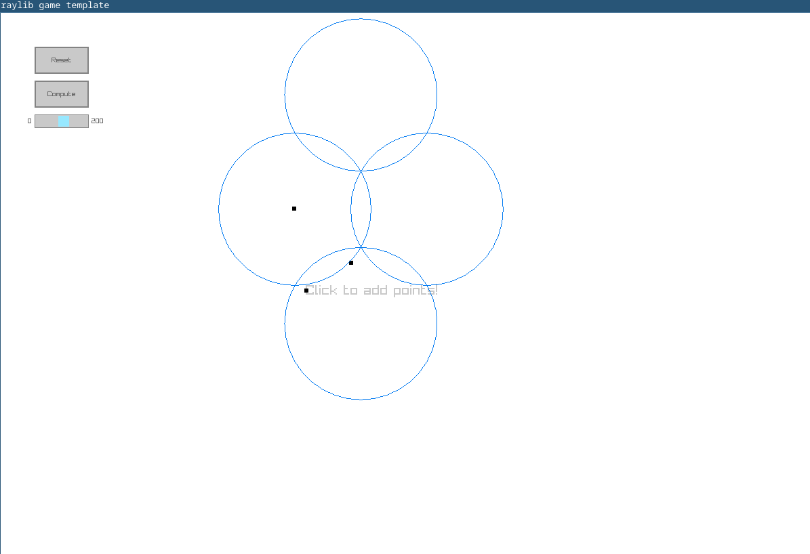
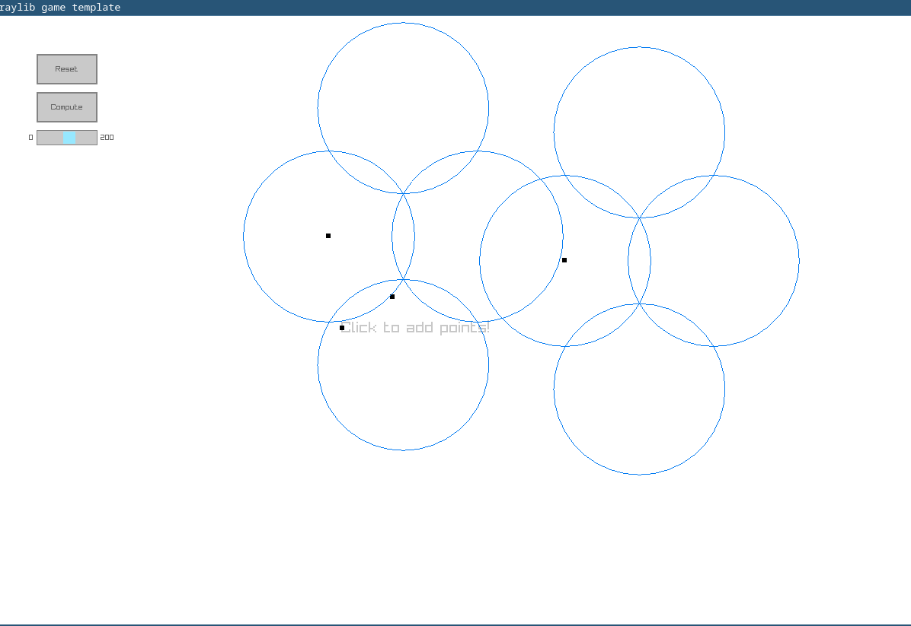

# Unit Disk Cover Approximation Simulator

### Description

Implementation of paper: Approximation algorithms for the unit disk cover problem in 2D and 3D https://www.sciencedirect.com/science/article/pii/S092577211630030X 

### Screenshots




### Instructions to run

1. Use CMake to generate the makefiles inside a build directory

``` sh
$ mkdir ./build && cd ./build
$ cmake ..
```

2. Compile

``` sh
$ make
```

3. Run!

``` sh
$ ./unit-disk-cover-sim/unit-disk-cover-sim
```
